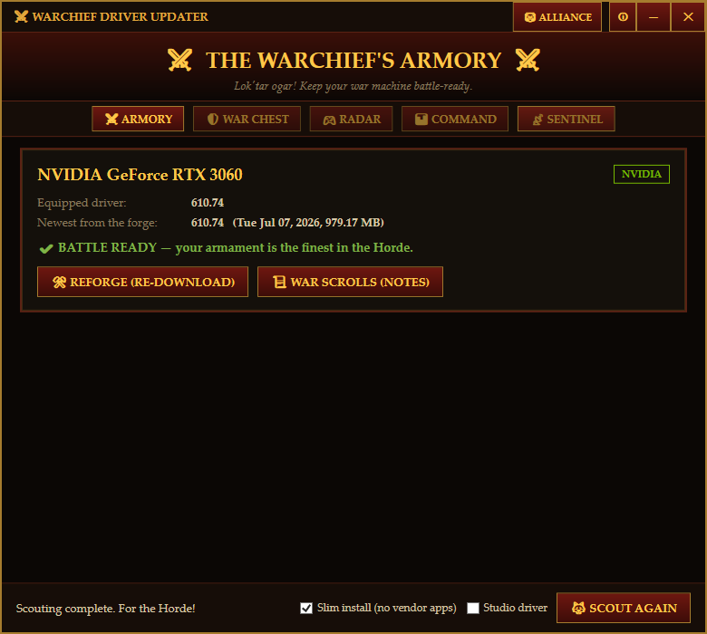
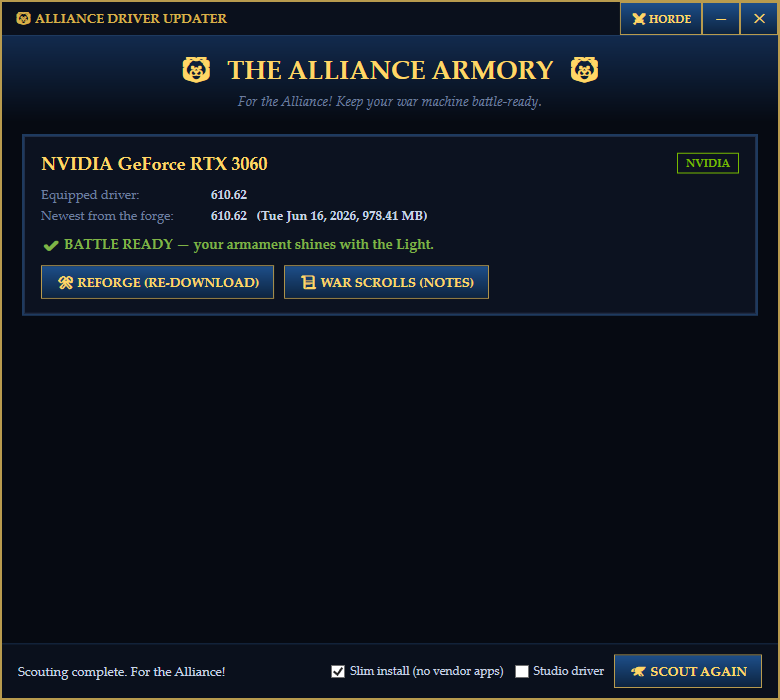

# ⚔ Warchief Driver Updater

**Lok'tar ogar!** A Horde-themed, zero-dependency GPU driver checker & downloader for Windows.
Detects your NVIDIA / AMD / Intel graphics cards, asks the vendors' own servers for the newest driver,
and forges (downloads) it for you with one click — all wrapped in a dark iron-and-gold war room UI.

> Unofficial fan project. Not affiliated with or endorsed by Blizzard Entertainment, NVIDIA, AMD, or Intel.
> World of Warcraft and the Horde are trademarks of Blizzard Entertainment.

<p align="center">
  
  
</p>

## Features

**New in 2.0 — five war-room pages, one lean app:**

- 🛡 **War Chest** — every driver you install is remembered; if a new one betrays you, **re-equip a previous version in one click**. Optionally raises a Windows System Restore point before each install (built-in System Restore, nothing extra).
- 📡 **The Sentinel** — opt-in scheduled scout (daily/weekly, via Windows Task Scheduler) that checks for new drivers in the background and fires a tray notification when war gear drops. Plus optional minimize-to-tray.
- 🎮 **Game Ready Radar** — reads the game library files your launchers already keep on disk (Steam manifests, Battle.net/Epic/Ubisoft/EA registrations — nothing new installed) and cross-checks them against the driver's official release notes to show which of *your* games the update tunes.
- 📊 **Rig Command Center** — live temperature, clocks, power, fan, usage, VRAM and driver age
  for **all vendors**, with zero monitoring agents installed. Usage/VRAM come from Windows' GPU
  counters; temp/clock/power/fan come from Windows' WDDM telemetry — the same hidden `gdi32`
  API Task Manager uses, fed by every modern (WDDM 2.4+) driver, NVIDIA/AMD/Intel alike. NVIDIA
  cards get extra precision via `nvidia-smi` (ships inside the driver). Readings were calibrated
  against `nvidia-smi` ground truth: temperature matched to the degree, clocks to the MHz.

### ⚖ One army, every banner — feature parity across vendors

Vendor tools only care about their own silicon. The Warchief serves **every card in your rig,
side by side, with the same features** — and is honest about the few things Windows simply
doesn't expose without the vendors' own bloatware:

| Feature | NVIDIA | AMD (incl. Ryzen APUs) | Intel (Arc / Iris Xe / UHD) |
|---|:---:|:---:|:---:|
| Detect GPU + installed driver | ✅ | ✅ | ✅ |
| Check newest driver (official sources) | ✅ | ✅ | ✅ |
| Direct vendor-server download | ✅ | ✅ | ✅ |
| Slim / driver-only install | ✅ | ✅ | — (Intel's package is already lean) |
| Measured "bloat skipped" savings | ✅ | ✅ | — |
| Game Ready / Studio toggle | ✅ | n/a | n/a |
| War Chest rollback (re-equip old driver) | ✅ | ✅ | ✅ |
| Restore point before install | ✅ | ✅ | ✅ |
| Sentinel auto-scout notifications | ✅ | ✅ | ✅ |
| Radar release-notes game matching | ✅ | ✅ | ✅ |
| Command Center: usage / VRAM / driver age | ✅ | ✅ | ✅ |
| Command Center: temp / clocks / power / fan | ✅ via `nvidia-smi` (ships in the driver) | ✅ via Windows' WDDM telemetry — the same hidden API Task Manager reads | ✅ same (WDDM 2.4+ driver, Win10 1803+) |

**The classics:**

- ⚔🦁 **Pick your faction** — one click in the title bar switches between the **Horde** theme
  (black iron, blood red, gold) and the **Alliance** theme (royal blue, gold, silver). Your
  choice is remembered between sessions, and the **window, taskbar, Start Menu and desktop
  icons all change sigils** with it (red crossed swords vs. blue fleur-de-lis).
- 🧹 **Slim install — no NVIDIA App, no Adrenalin app** — optional (on by default):
  - **NVIDIA:** unpacks the driver package with 7-Zip, strips out the NVIDIA App / GeForce
    Experience / telemetry components, patches the install manifest, and runs a quiet
    driver-only install (same technique as NVCleanstall).
  - **AMD:** unpacks the Adrenalin package without `Packages\Apps` and uses AMD's own
    documented silent installer (`Setup.exe -INSTALL -USE <Packages\Drivers>`) for a
    driver-only install with no Adrenalin software.
  - Either way you get a progress bar while the smithy works and a clear victory (or defeat)
    dialog when the installer finishes, with the real installer exit code checked.
  - Uses your installed 7-Zip if present, otherwise fetches the official standalone `7zr.exe`
    (~600 KB) on first use. Untick the checkbox any time to get the stock installer instead.
- 🐺 **Auto-scouting** — detects every NVIDIA, AMD, and Intel GPU in your rig via WMI,
  including the human-readable installed driver version (e.g. `560.94`, not `32.0.15.6094`).
  Ryzen APU graphics and Intel Arc / Iris Xe / UHD are matched to their unified driver
  packages automatically.
- 🎨 **Game Ready or Studio** — a footer toggle switches NVIDIA lookups between Game Ready
  and Studio drivers (both WHQL, straight from NVIDIA's API).
- ⚒ **Straight from the forge** — queries **NVIDIA's official driver lookup API** and **AMD's
  official per-product driver pages**. No third-party mirrors, downloads come directly from
  `download.nvidia.com` / `drivers.amd.com`.
- 🧠 **Smart matching** — maps your exact GPU name to NVIDIA's product IDs (desktop vs. laptop
  handled automatically) and derives the correct AMD product page from the model number.
  Detects Windows 10 vs. 11 and picks the right installer (WHQL, DCH).
- 🔥 **Update status at a glance** — `BATTLE READY` when you're current, `NEW WAR GEAR AVAILABLE`
  when the vendors have shipped something newer.
- 📜 **War scrolls** — one click to the official release notes.
- ⚔ **Forge & equip** — downloads with a rage-bar progress meter to your Downloads folder, then
  launches the installer on demand. Nothing is installed silently, ever.
- 🪶 **Zero dependencies** — pure PowerShell 5.1 + WPF. No Node, no Python, no runtime installs.
  Works on any stock Windows 10/11 machine.

## 🛡 "Will this break my computer?" — a note for cautious dads

No. Sit down, Dad, let's talk. Here is exactly what this thing does, in plain English:

1. **It looks at your PC** and asks Windows "hey, what graphics card is in here?" (Windows
   already knows; we just ask politely.)
2. **It asks NVIDIA, AMD, or Intel** — the actual companies, on their actual official websites — "what's
   the newest driver for this card?" This is the same thing you'd do by hand in a browser,
   except you don't have to remember whether you own an RTX or a GTX or a VCR.
3. **It downloads the driver from NVIDIA's, AMD's, or Intel's own servers.** Not from a forum. Not from
   `totally-real-drivers-free.biz`. The download link comes straight from the vendor, byte for
   byte the same file you'd get clicking around their site for 20 minutes.
4. **Nothing installs until you click the big INSTALL button.** The tool never installs anything
   behind your back. When you do click it, *Windows itself* will pop up the blue "do you want
   to allow this?" screen — that's normal, that's Windows doing its job, click Yes.

**"But what if it goes wrong?"** The worst realistic case is the same as any driver update done
by hand: you'd re-run the installer, or use Windows' built-in driver rollback (Device Manager →
your GPU → Properties → Driver → Roll Back). Your files, photos, tax spreadsheets, and bookmarked
fishing videos are never touched. This tool doesn't modify Windows, doesn't run at startup,
doesn't phone home, has no ads, no accounts, no subscriptions, and no opinions about your
browser homepage.

**"How do I know it's not up to something?"** It's open source — every single line of code is in
this repository, readable by anyone, and it's plain PowerShell (a scripting language, not a
mystery blob). Paranoid? Good instinct! Read [WarchiefDriverUpdater.ps1](WarchiefDriverUpdater.ps1)
yourself or build the exe from source with one command. The only thing it writes outside its
own folder is the downloaded driver (to your Downloads folder, where you can see it) and a tiny
settings file remembering whether you're Horde or Alliance. Which is Horde. Obviously.

**"Can I get rid of it?"** Completely, in one click: Windows Settings → Apps → Installed apps →
Warchief Driver Updater → Uninstall. It removes itself, its shortcuts, and its settings, and
leaves your computer exactly as it found it. Not even a goodbye note.

## Getting started

**Option A — installer (recommended):** grab `WarchiefDriverUpdater-Setup.exe` from the
[Releases](../../releases) page, run it, and you're done. You get a Start Menu (and optional
desktop) shortcut, plus a normal uninstall entry in *Windows Settings → Apps → Installed apps*.
The installer also supports `-Silent` for unattended installs and `-Uninstall [-Silent]`.

**Option B — portable:** clone the repo and double-click **`Start Warchief Driver Updater.bat`**
(or a built `WarchiefDriverUpdater.exe`). No installation needed.

Either way: the armory opens, scouts ride out, and you'll see whether new war gear awaits.

> **SmartScreen note:** the exes are compiled from this repo's PowerShell source with
> [ps2exe](https://github.com/MScholtes/PS2EXE) and are not code-signed, so Windows SmartScreen
> may show "unknown publisher" the first time. Click *More info → Run anyway*, or build the exe
> yourself from source (see below) if you'd rather trust your own build.

## Building the exe yourself

```powershell
powershell -ExecutionPolicy Bypass -File .\Build.ps1
```

This auto-installs the [ps2exe](https://www.powershellgallery.com/packages/ps2exe) module
(CurrentUser scope), generates the icon in `assets\`, and drops both
`WarchiefDriverUpdater.exe` and `WarchiefDriverUpdater-Setup.exe` into `dist\`.

No admin rights are needed to check or download; the driver installer itself will ask for
elevation when you click **EQUIP (INSTALL)** — that prompt comes from the vendor's installer,
not from this tool.

## Headless self-test

For debugging or CI, run the built-in diagnostics (no GUI):

```powershell
powershell -NoProfile -ExecutionPolicy Bypass -File .\WarchiefDriverUpdater.ps1 -SelfTest
```

It prints detected GPUs, installed versions, and the latest driver + download URL each vendor reports.

## How it works

| Vendor | Latest-version source | Download source |
|---|---|---|
| NVIDIA | `nvidia.com/Download/API/lookupValueSearch.aspx` (GPU → product IDs), then the `AjaxDriverService` JSON API (Game Ready or Studio) | `us.download.nvidia.com` (direct link from the API) |
| AMD | The official per-GPU driver page on `amd.com` (server-rendered; scraped for the Adrenalin version), with evergreen fallback pages since AMD ships one unified package for all supported Radeons & APUs | `drivers.amd.com` (direct link from that page, sent with the required referer) |
| Intel | Intel's official unified Arc/Iris Xe driver page (via the `intel.cn` mirror when the US site's bot protection blocks scripts — same page, same files) | `downloadmirror.intel.com` (Intel's own CDN, direct link from the page) |

Installed versions come from `Win32_VideoController` (NVIDIA's friendly version is decoded from
the WMI version string) and, for AMD, the `RadeonSoftwareVersion` registry value.

## Windows compatibility

| Windows | Support |
|---|---|
| Windows 11 / Windows 10 1803+ (64-bit) | ✅ Everything works, full telemetry |
| Windows 10 1507–1709 | ✅ Works — NVIDIA lookups automatically switch to standard (non-DCH) packages; live telemetry/usage rows appear only where that build supports them |
| Windows 8.1 / 8 (64-bit) | 🟡 Legacy mode — NVIDIA still resolves automatically (their final 475.xx security-update branch); AMD/Intel stopped making drivers for it, so those cards get a guided button to the vendor's legacy page |
| Windows 7 SP1 (64-bit) | 🟡 Same as 8.1. Requires [WMF 5.1](https://www.microsoft.com/en-us/download/details.aspx?id=54616) (PowerShell 5.1) and .NET Framework 4.5.2+. The Sentinel schedules via classic `schtasks` |
| 32-bit Windows | ❌ GPU vendors no longer ship 32-bit drivers at all |

On legacy Windows the app tells you so in the status bar and serves the newest driver *that exists
for your OS* — it never lies about a current driver being available when the vendor has moved on.

## Known limits

- Retired hardware auto-matches to its vendor's frozen final branch: pre-RX Radeons (R9/R7/R5,
  Fury, HD 7700+) get AMD Software 22.6.1, and Intel HD/UHD 6xx (7th–10th gen) gets the
  31.0.101.21xx legacy driver. Only *truly* ancient GPUs — pre-2012 Radeon HD 5000/6000 and
  pre-7th-gen Intel — predate those branches and get an **OPEN VENDOR SITE** button instead.
  The same graceful button appears if a vendor page is ever unreachable.
- Intel installs use Intel's stock installer (their package is already light on bloat, so
  there's no slim mode for it).

## Contributing

Issues and pull requests are welcome. Keep it dependency-free, keep it Horde. 🩸

## License & credit

Copyright © 2026 **[dontshome](https://github.com/dontshome)**. Licensed under the
**[GNU General Public License v3.0](LICENSE)** (or later).

This is **copyleft** open source — you're free to use, study, share, and modify it, but:

- ✅ **You must credit this original project** — keep the copyright notice and a link back to
  [this repository](https://github.com/dontshome/Warchief-Driver-Updater).
- ✅ **If you distribute a modified version, it must also be open source** under the GPL, so the
  whole community keeps benefiting.
- ✅ **State your changes** so bugs in forks aren't blamed on the original.

In short: build on it, improve it, share it — just keep it open and give credit where it's due.
See the [LICENSE](LICENSE) file for the full legal terms, and click the **ⓘ** button in the app
for the in-program notice.
